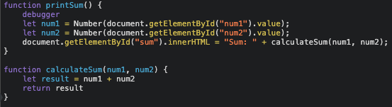

# Waynar Bocangel Calderon Lab04 PID: A15881859
### Question 1
The bug was that both inputs to calculate sum are interpreted as strings since they are being recovered from the DOM as strings. Because of this instead of performing arithmetic it perferms concatenation.
### Question 2
I implicitly casted both recovered numbers from the DOM from strings to numbers.

### Question 3
The name of the new JSON file is citylots.json
### Question 4
The file that initiated the download was part2.json
### Question 5
The file size is 11.7 MB
### Question 6
It took 83 ms
### Question 7
The User-Agent was Mozilla/5.0 (Macintosh; Intel Mac OS X 10_15_7) AppleWebKit/537.36 (KHTML, like Gecko) Chrome/90.0.4430.85 Safari/537.36
### Question 8
It came from an Apache server
### Question 9
It was last modified Tue, 26 Jan 2021 22:14:13 GMT
### Question 10
The content type was application/json
### Question 11
The method that initiated the call was fetchData()